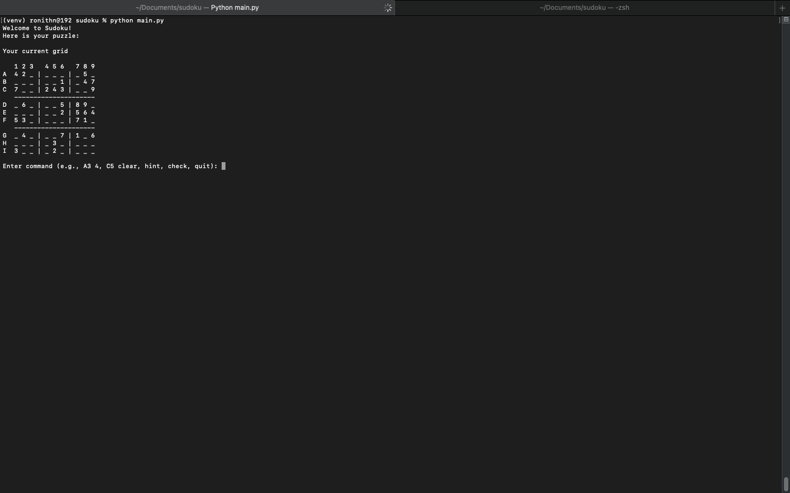
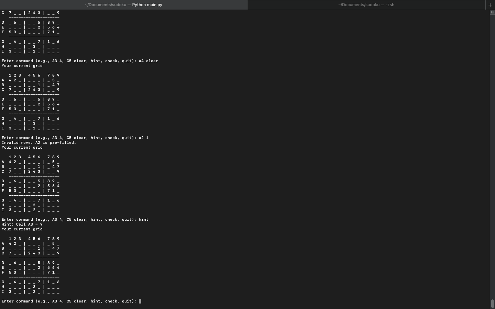
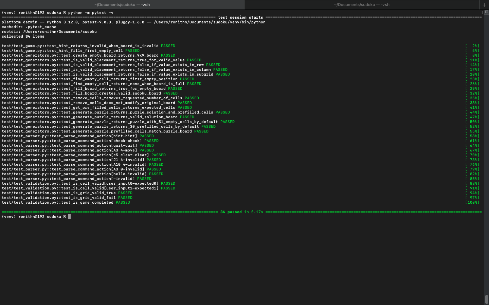
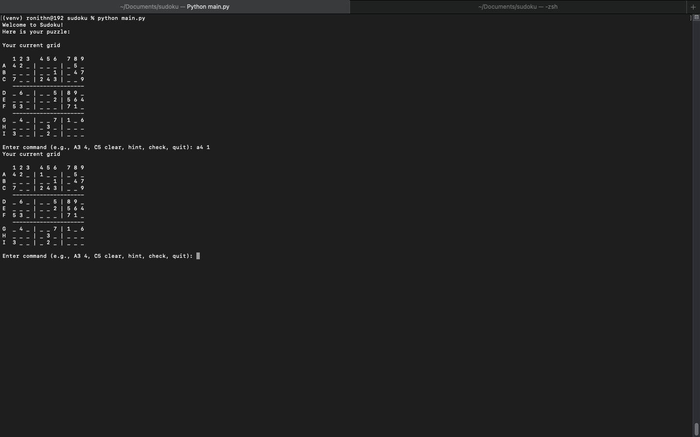

# Sudoku Command Line Game

A Python command-line Sudoku game that allows users to play Sudoku in the terminal.

Features include:

- Play Sudoku using simple text commands
- Insert numbers into cells
- Clear user-entered cells
- Validate board rules
- Get hints
- Detect puzzle completion
- Automated tests using pytest

---

# Project Structure

```text
sudoku/
├── main.py
├── game.py
├── parser.py
├── render.py
├── models.py
├── constants.py
├── README.md
└── tests/
    ├── test_game.py
    └── test_parser.py
```

# Requirements for this project

```text
Python 3.12 (or your version)
pytest
```

# Installation

## For Mac users

```bash
# Clone the repository
git clone https://github.com/Ronith900/sudoku.git

# Move into project folder
cd sudoku

# Create virtual environment
python -m venv venv

# Activate virtual environment
source venv/bin/activate

# Install dependencies
pip install -r requirements.txt
```

## For Windows users

```bash
# Clone the repository
git clone https://github.com/Ronith900/sudoku.git

# Move into project folder
cd sudoku

# Create virtual environment
python -m venv venv

# Activate virtual environment
venv\Scripts\activate

# Install dependencies
pip install -r requirements.txt
```

# How to run the game

```bash
From the Project root
python main.py
```

# How to execute the test cases

```bash
From the Project root
python -m pytest -v
```

# Demo


### Start Game




### Clear and Hint Feature



### Pytest Results




### User Input


